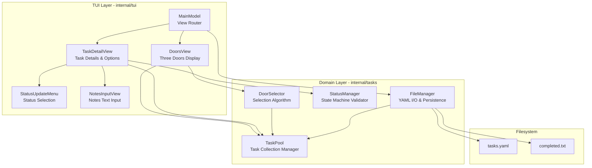

# Components

## Component Overview

The application is divided into **two primary layers**:

1. **TUI Layer** (`internal/tui`) - User interface components using Bubbletea
2. **Domain Layer** (`internal/tasks`) - Business logic and data management

## TUI Layer Components

### Component: DoorsView (Three Doors Display)

**Responsibility:** Render the Three Doors interface and handle door selection navigation.

**Key Interfaces:**

**Exposed:**
- `NewDoorsView(pool *TaskPool) *DoorsView` - Constructor
- `Update(msg tea.Msg) (tea.Model, tea.Cmd)` - Bubbletea update handler
- `View() string` - Render doors to terminal

**Consumed:**
- `TaskPool.GetAvailableForDoors() []*Task` - Get tasks for door selection
- `DoorSelection.SelectDoors(pool, 3)` - Generate three random doors

**Dependencies:**
- `internal/tasks.TaskPool` - Source of tasks
- `internal/tasks.DoorSelection` - Door selection logic
- `lipgloss` - Styling and box rendering

**State Managed:**
- `currentDoors` - The three tasks being displayed
- `cursorPosition` - Which door is highlighted (0-2)
- `sessionCompletionCount` - Tasks completed this session

**Key Behaviors:**
- **Keyboard: 1/2/3** - Select corresponding door, transition to TaskDetailView
- **Keyboard: R** - Refresh doors (generate new selection)
- **Keyboard: Q** - Quit application
- **Keyboard: Arrow Keys** - Move cursor between doors (visual highlight)

**Rendering Example:**
```
┌─────────────────┐  ┌─────────────────┐  ┌─────────────────┐
│   DOOR 1 🔵     │  │   DOOR 2 🔴     │  │   DOOR 3 🟡     │
│   [TODO]        │  │   [BLOCKED]     │  │   [IN-PROGRESS] │
│                 │  │                 │  │                 │
│  Write arch...  │  │  Implement St...│  │  Review PRD...  │
│  (truncated)    │  │  (truncated)    │  │  (truncated)    │
│                 │  │                 │  │                 │
└─────────────────┘  └─────────────────┘  └─────────────────┘

Completed this session: 3
Press 1, 2, 3 to select | R to refresh | Q to quit
Progress over perfection. Just pick one and start. ✨
```

### Component: TaskDetailView

**Responsibility:** Display full task details and provide options for status updates, note-taking, and navigation.

**Key Interfaces:**

**Exposed:**
- `NewTaskDetailView(task *Task, pool *TaskPool) *TaskDetailView` - Constructor
- `Update(msg tea.Msg) (tea.Model, tea.Cmd)` - Bubbletea update handler
- `View() string` - Render task detail screen

**Consumed:**
- `Task.UpdateStatus(newStatus, note)` - Change task status
- `Task.AddNote(text)` - Add progress note
- `Task.SetBlocker(reason)` - Set blocker description
- `TaskPool.UpdateTask(task)` - Persist changes

**State Managed:**
- `currentTask` - The task being viewed
- `viewMode` - "detail" | "status-menu" | "notes-input" | "blocker-input"
- `statusMenuCursor` - Selected status in menu (0-4)
- `notesInputBuffer` - Text being typed for note
- `blockerInputBuffer` - Text being typed for blocker

**Key Behaviors:**
- **Detail View Mode:**
  - **S** - Open status update menu
  - **N** - Open notes input
  - **B** - Mark as blocked (opens blocker input)
  - **ESC** - Return to DoorsView

- **Status Menu Mode:**
  - **Arrow Keys** - Navigate status options
  - **Enter** - Select status, save, return to detail
  - **ESC** - Cancel, return to detail

**Rendering Example:**
```
┌─────────────────────────────────────────────────────────────┐
│ TASK DETAILS                                                │
├─────────────────────────────────────────────────────────────┤
│                                                             │
│ Write architecture document for ThreeDoors                 │
│                                                             │
│ Status: IN-PROGRESS 🟡                                      │
│ Created: 2025-11-07 10:00                                   │
│ Updated: 2025-11-07 14:45                                   │
│                                                             │
│ Notes:                                                      │
│  • [14:15] Started with high-level overview                │
│  • [14:45] Completed data models section                   │
│                                                             │
├─────────────────────────────────────────────────────────────┤
│ Options:                                                    │
│  [S] Update Status  [N] Add Note  [B] Mark Blocked         │
│  [ESC] Return to Doors                                      │
└─────────────────────────────────────────────────────────────┘
```

### Component: StatusUpdateMenu

**Responsibility:** Render status selection menu and validate transitions.

**Key Interfaces:**
- `NewStatusUpdateMenu(currentStatus TaskStatus) *StatusUpdateMenu`
- `Update(msg tea.Msg) (TaskStatus, bool)` - Returns (selectedStatus, confirmed)
- `View() string` - Render menu

**Key Behaviors:**
- Highlights invalid transitions in gray (disabled)
- Shows current status with checkmark
- Arrow keys navigate, Enter confirms, ESC cancels

### Component: NotesInputView

**Responsibility:** Multi-line text input for adding progress notes.

**Dependencies:**
- `bubbles/textarea` - Multi-line text input component

**Key Behaviors:**
- Ctrl+S to save and confirm
- ESC to cancel
- Character counter shows remaining space (1000 chars max)
- Auto-wraps text at terminal width

### Component: MainModel (Root Bubbletea Model)

**Responsibility:** Orchestrate view transitions and manage global application state.

**State Managed:**
- `currentView` - "doors" | "detail"
- `doorsView` - DoorsView instance
- `detailView` - TaskDetailView instance (nil when in doors view)
- `taskPool` - Global TaskPool
- `fileManager` - FileManager for persistence

**Message Types:**
```go
type SelectDoorMsg struct { DoorIndex int }
type ReturnToDoorsMsg struct{}
type TaskUpdatedMsg struct { Task *Task }
type RefreshDoorsMsg struct{}
```

**Message Routing Example:**

```go
func (m MainModel) Update(msg tea.Msg) (tea.Model, tea.Cmd) {
    switch m.currentView {
    case "doors":
        // In doors view - delegate to DoorsView
        newDoorsView, cmd := m.doorsView.Update(msg)
        m.doorsView = newDoorsView.(*DoorsView)

        // Check if user selected a door
        if selectMsg, ok := msg.(SelectDoorMsg); ok {
            task := m.doorsView.GetTask(selectMsg.DoorIndex)
            m.detailView = NewTaskDetailView(task, m.taskPool)
            m.currentView = "detail"
            return m, nil
        }

        return m, cmd

    case "detail":
        // In detail view - delegate to TaskDetailView
        newDetailView, cmd := m.detailView.Update(msg)
        m.detailView = newDetailView.(*TaskDetailView)

        // Check if user wants to return to doors
        if _, ok := msg.(ReturnToDoorsMsg); ok {
            m.detailView = nil
            m.currentView = "doors"
            // Refresh doors to reflect any changes
            m.doorsView.RefreshDoors()
            return m, nil
        }

        // Check if task was updated - save to file
        if updateMsg, ok := msg.(TaskUpdatedMsg); ok {
            m.taskPool.UpdateTask(updateMsg.Task)
            return m, func() tea.Msg {
                if err := m.fileManager.SaveTasks(m.taskPool); err != nil {
                    return ErrorMsg{err}
                }
                return nil
            }
        }

        return m, cmd

    default:
        return m, nil
    }
}
```

## Domain Layer Components

### Component: FileManager

**Responsibility:** Handle all file I/O operations including YAML parsing, atomic writes, and file initialization.

**Key Interfaces:**
- `NewFileManager(config *Config) *FileManager`
- `LoadTasks() (*TaskPool, error)` - Load tasks from tasks.yaml
- `SaveTasks(pool *TaskPool) error` - Save tasks to tasks.yaml (atomic write)
- `AppendCompleted(task *Task) error` - Append to completed.txt
- `InitializeFiles() error` - Create directory and sample files if missing

**Key Behaviors:**

**LoadTasks():**
1. Check if tasks.yaml exists
2. If not, call `InitializeFiles()` to create sample tasks
3. Read and unmarshal YAML
4. Validate all tasks
5. Return populated TaskPool

**SaveTasks():**
1. Marshal TaskPool to YAML
2. Write to `tasks.yaml.tmp`
3. `fsync()` to flush to disk
4. Atomic rename `tasks.yaml.tmp` → `tasks.yaml`

**AppendCompleted():**
1. Format: `[timestamp] task_id | task_text`
2. Atomic append to completed.txt

### Component: TaskPool

**Responsibility:** In-memory management of all tasks, filtering, and recently-shown tracking.

(See Data Models section for full details)

### Component: StatusManager

**Responsibility:** Validate status transitions and enforce state machine rules.

**Key Interfaces:**
- `ValidateTransition(from, to TaskStatus) error` - Check if transition is allowed
- `GetValidTransitions(current TaskStatus) []TaskStatus` - List allowed next states

### Component: DoorSelector

**Responsibility:** Implement door selection algorithm with diversity and randomization.

**Algorithm (Tech Demo - Random Selection):**
- Get available tasks from TaskPool
- Random selection using Fisher-Yates shuffle
- Mark selected tasks as recently shown
- Return DoorSelection with 0-3 tasks

## Component Interaction Diagram



---
