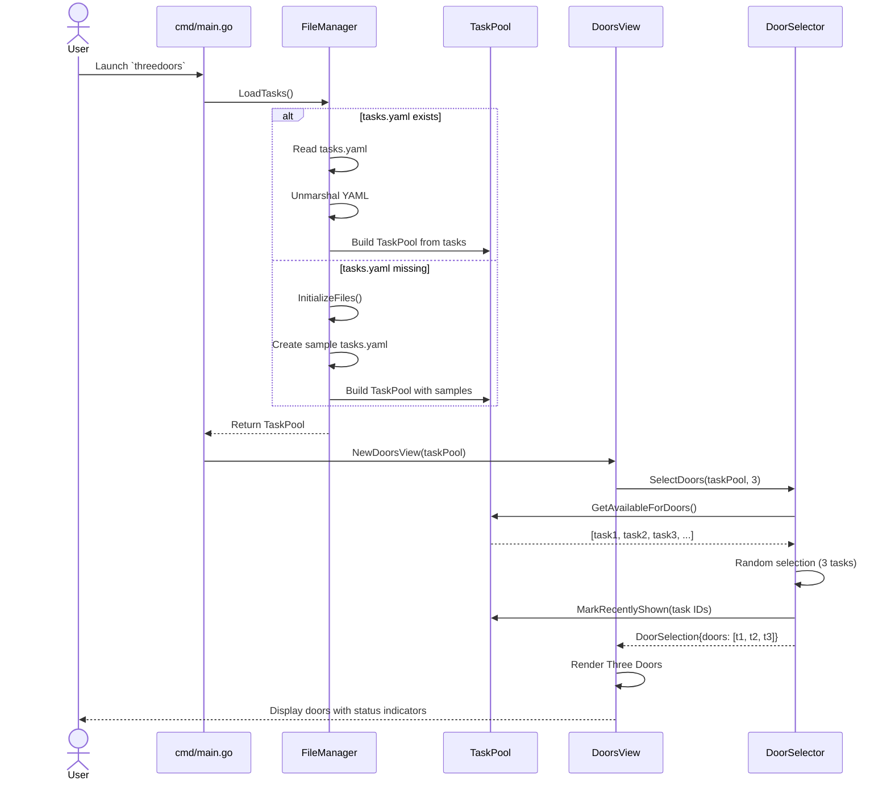
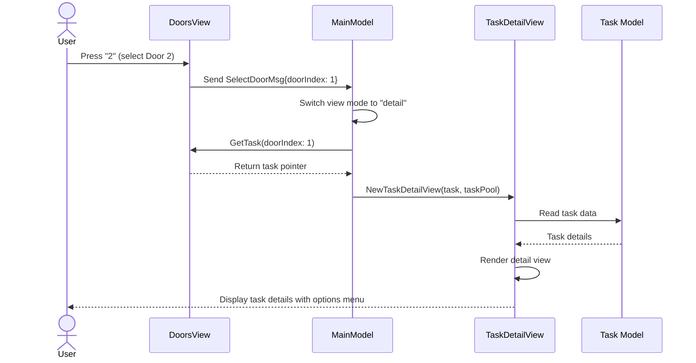
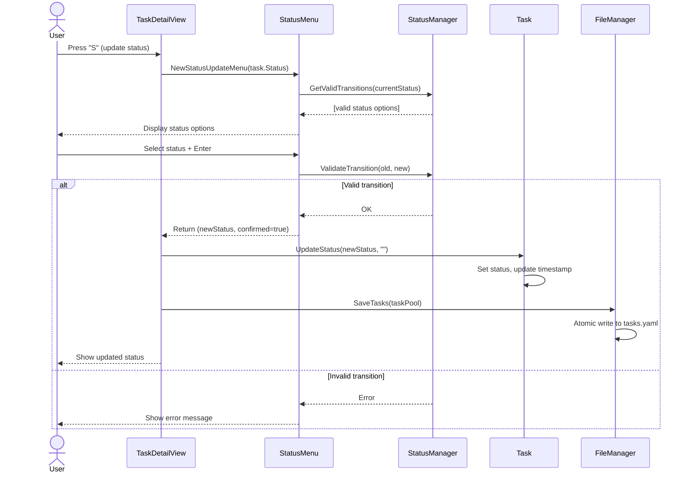
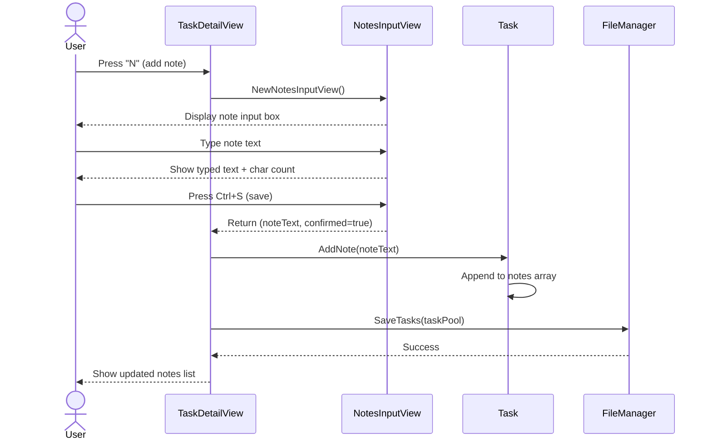
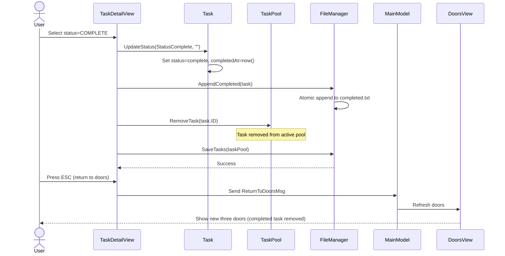
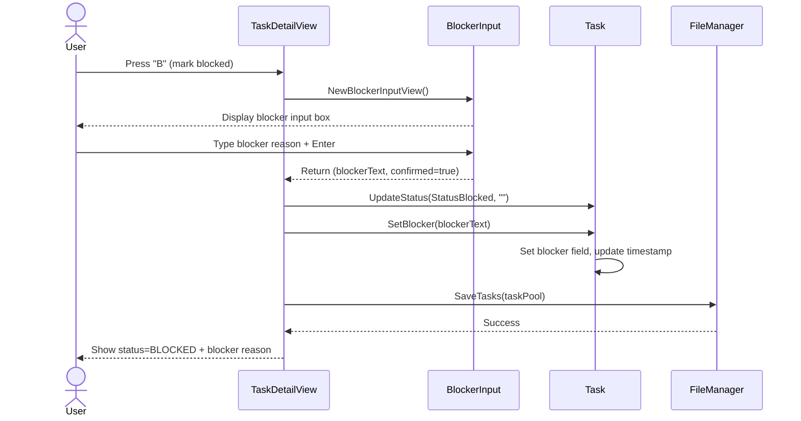

# Core Workflows

## Workflow 1: Application Startup & Three Doors Display

## Workflow 2: Select Door & Enter Task Detail View

## Workflow 3: Update Task Status

## Workflow 4: Add Progress Note

## Workflow 5: Complete Task & Return to Doors

## Workflow 6: Mark Task as Blocked

---
