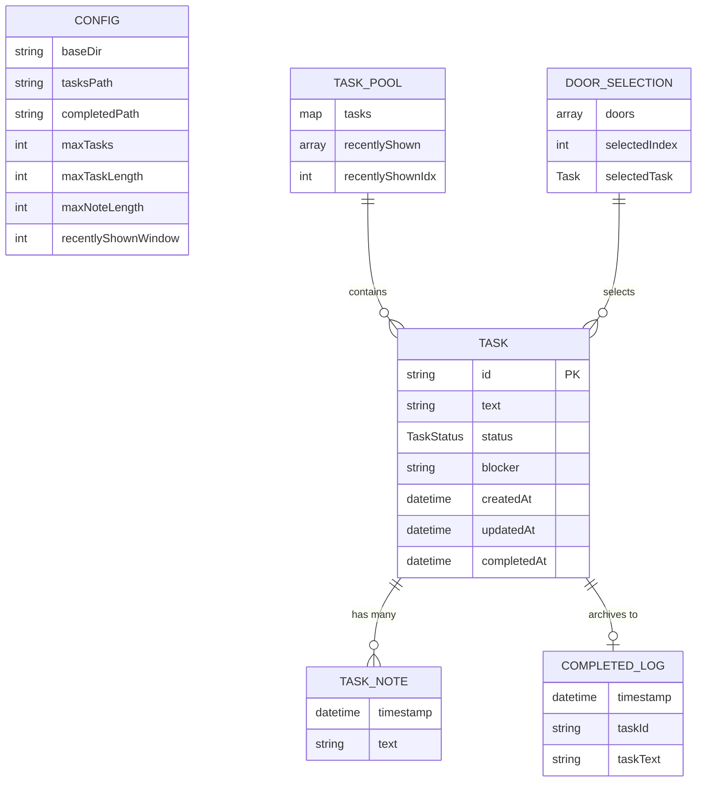

# Data Models

## TaskStatus (Enum)

**Purpose:** Defines the lifecycle states a task can be in.

**Values:**
```go
type TaskStatus string

const (
    StatusTodo       TaskStatus = "todo"
    StatusBlocked    TaskStatus = "blocked"
    StatusInProgress TaskStatus = "in-progress"
    StatusInReview   TaskStatus = "in-review"
    StatusComplete   TaskStatus = "complete"
)
```

**Valid Transitions:**
```
todo → in-progress → in-review → complete
todo → blocked → in-progress
in-progress → blocked → in-progress
blocked → todo (unblock)
Any state → complete (force complete)
```

**State Machine Diagram:**

```mermaid
stateDiagram-v2
    [*] --> todo
    todo --> in-progress
    todo --> blocked
    todo --> complete
    blocked --> todo
    blocked --> in-progress
    blocked --> complete
    in-progress --> blocked
    in-progress --> in-review
    in-progress --> complete
    in-review --> in-progress
    in-review --> complete
    complete --> [*]
```

## Task

**Purpose:** Represents a single task with full lifecycle metadata including status, notes, and history.

**Key Attributes:**
- `id`: `string` - Unique identifier (UUID v4)
- `text`: `string` - Task description (1-500 chars, UTF-8)
- `status`: `TaskStatus` - Current lifecycle state (default: "todo")
- `notes`: `[]TaskNote` - Progress notes and updates
- `blocker`: `string` - Blocker description (only when status=blocked)
- `createdAt`: `time.Time` - When task was created
- `updatedAt`: `time.Time` - Last modification timestamp
- `completedAt`: `*time.Time` - When marked complete (nil if not complete)

**Validation Rules:**
1. `id`: Must be valid UUID v4
2. `text`: 1-500 chars, no newlines/tabs, trimmed whitespace
3. `status`: Must be one of valid TaskStatus values
4. `notes`: Can be empty array
5. `blocker`: Required non-empty when status=blocked, otherwise empty
6. `createdAt`: Required, cannot be zero
7. `updatedAt`: Required, >= createdAt
8. `completedAt`: Only set when status=complete

**YAML Storage Format (tasks.yaml):**

```yaml
tasks:
  - id: a1b2c3d4-e5f6-7890-abcd-ef1234567890
    text: Write architecture document for ThreeDoors
    status: in-progress
    notes:
      - timestamp: 2025-11-07T14:15:00Z
        text: Started with high-level overview
      - timestamp: 2025-11-07T14:45:00Z
        text: Completed data models section
    blocker: ""
    created_at: 2025-11-07T10:00:00Z
    updated_at: 2025-11-07T14:45:00Z
    completed_at: null
```

**Key Methods:**
- `NewTask(text string) *Task` - Create new task with defaults
- `Validate() error` - Validate all fields
- `UpdateStatus(newStatus TaskStatus, note string) error` - Change status with validation
- `AddNote(text string)` - Append progress note
- `SetBlocker(reason string) error` - Set blocker when status=blocked
- `IsValidTransition(newStatus TaskStatus) bool` - Check if transition is allowed

**UUID Generation:**
The task UUID is generated **immediately** in the `NewTask()` constructor using `uuid.New().String()`, ensuring the task has a unique identity before any persistence occurs. The UUID is immutable and never changes after task creation.

## TaskNote

**Purpose:** Captures progress updates and notes added to a task over time.

**Key Attributes:**
- `timestamp`: `time.Time` - When note was added (UTC)
- `text`: `string` - Note content (1-1000 chars)

**Design Decisions:**
- **Immutable:** Notes cannot be edited/deleted once added (append-only history)
- **Chronological:** Array order preserves time sequence
- **Longer text limit:** Notes can be more detailed than task text

## Config

**Purpose:** Centralized configuration for file paths and runtime limits.

**Key Attributes:**
- `baseDir`: `string` - Base directory for all ThreeDoors data (default: `~/.threedoors/`)
- `tasksPath`: `string` - Path to tasks file (default: `{baseDir}/tasks.yaml`)
- `completedPath`: `string` - Path to completed tasks file (default: `{baseDir}/completed.txt`)
- `maxTasks`: `int` - Maximum tasks to load (default: 1000)
- `maxTaskLength`: `int` - Maximum characters per task text (default: 500)
- `maxNoteLength`: `int` - Maximum characters per note (default: 1000)
- `recentlyShownWindow`: `int` - Ring buffer size (default: 10)

## TaskPool

**Purpose:** Manages in-memory collection of tasks filtered by status, with smart door selection.

**Key Attributes:**
- `tasks`: `map[string]*Task` - All tasks indexed by ID
- `recentlyShown`: `[]string` - Last N task IDs shown in doors (ring buffer)
- `recentlyShownIdx`: `int` - Current position in ring buffer
- `maxRecentlyShown`: `int` - Size of ring buffer (default: 10)

**Key Methods:**
- `AddTask(task *Task)` - Add task to pool
- `GetTask(id string) *Task` - Retrieve task by ID
- `UpdateTask(task *Task)` - Update existing task
- `RemoveTask(id string)` - Remove completed task from pool
- `GetTasksByStatus(status TaskStatus) []*Task` - Filter tasks by status
- `GetAvailableForDoors() []*Task` - Get tasks eligible for door selection
- `MarkRecentlyShown(taskID string)` - Add to recently shown buffer
- `IsRecentlyShown(taskID string) bool` - Check if in recently shown

**Door Selection Eligibility:**
- Status must be `todo`, `blocked`, or `in-progress` (exclude in-review and complete)
- Not in `recentlyShown` buffer (unless fewer than 3 tasks total)

## DoorSelection

**Purpose:** Represents the three tasks currently displayed as doors.

**Key Attributes:**
- `doors`: `[]*Task` - 0-3 tasks with full metadata
- `selectedIndex`: `int` - Which door selected (-1 if none)
- `selectedTask`: `*Task` - Pointer to selected task (nil if none)

## Data Model Diagram



---
