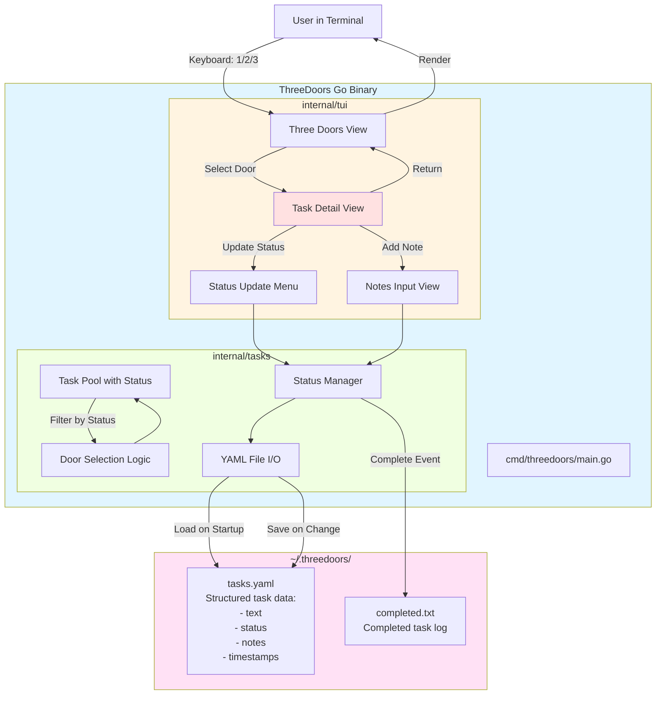

# High Level Architecture

## Technical Summary

ThreeDoors is a **monolithic CLI/TUI application** built in Go that implements a novel task selection interface called "Three Doors." The system follows a **layered architecture** with structured data storage (YAML/JSON) for task metadata including status tracking and notes. The core innovation lies in the UX pattern—presenting three diverse tasks as entry points, then diving deep into task details with status management (todo, blocked, in-progress, in-review, complete) and note-taking capabilities. The architecture uses **Bubbletea** for terminal UI management, YAML parsing for structured task data, and emphasizes rapid validation of the task detail workflow over premature optimization.

## High Level Overview

**Architectural Style:** **Simple Monolithic CLI Application**

**Rationale:** The Technical Demo phase prioritizes speed to validation over architectural sophistication. A monolith with direct dependencies allows rapid iteration without navigating abstraction layers.

**Repository Structure:** **Single Repository (Monorepo by default)**

The project uses a standard Go project layout within a single repository:
- `cmd/threedoors/` - Application entry point
- `internal/` - Private application code (tui, tasks packages)
- No need for workspace/multi-module complexity in Tech Demo

**Service Architecture:** **Single Process, No Services**

The application runs as a single Go binary with no external service dependencies:
- No API servers (it IS the interface)
- No databases (YAML file storage)
- No message queues or external integrations
- Pure local execution

**Primary User Interaction Flow:**

1. User launches `threedoors` CLI command
2. App reads `~/.threedoors/tasks.yaml` (structured format with task metadata)
3. Bubbletea TUI renders Three Doors interface (3 randomly selected tasks with status indicators)
4. **User selects door (1/2/3)** → **Enters Task Detail View**
5. **Task Detail View shows:**
   - Full task description
   - Current status (todo/blocked/in-progress/in-review/complete)
   - Existing notes/progress updates
   - **Options menu:**
     - Update status → submenu to select new status
     - Add note → text input for progress notes
     - Mark blocked → capture blocker reason
     - Return to doors → save changes and go back
6. **Status change or note added** → persist to tasks.yaml immediately
7. **Return to Three Doors** → show updated doors (completed tasks removed, status reflected)
8. User can refresh (R) to see different doors or quit (Q)

**Key Architectural Decisions:**

1. **Structured Data Format:** YAML for human-readability and metadata support (status, notes, timestamps)
2. **Persistent Task State:** All status changes and notes written to tasks.yaml immediately
3. **Task Detail View:** New UI component for deep task interaction (not in original PRD)
4. **Status Workflow:** Five states enable proper task lifecycle tracking
5. **Atomic Writes:** All file updates use atomic write pattern to prevent corruption

## High Level Project Diagram



## Architectural and Design Patterns

**1. Layered Architecture (Simplified)**

**Recommendation: Two-Layer Separation**

**Rationale:**
- Separates UI concerns (Bubbletea event loop) from task management logic
- Allows testing door selection algorithm independently of TUI
- Minimal overhead (~2 packages) vs. flat structure
- Easy to evolve when adding Apple Notes in Epic 2

**Structure:**
- **TUI Layer:** Bubbletea Model/Update/View, keyboard handling, rendering
- **Tasks Layer:** File I/O, task pool management, door selection

**2. Model-View-Update (MVU) Pattern**

**Mandatory for Bubbletea - No Options**

**Description:** Bubbletea enforces the **Elm Architecture (MVU)** pattern:
- **Model:** Application state (current doors, task pool, completion count, UI mode)
- **Update:** Pure functions handling messages (key presses, file load results)
- **View:** Render function transforming model into terminal output

**Rationale:** Framework requirement; aligns with functional reactive patterns; excellent for UI state management.

**3. Repository Pattern (Deferred)**

**Decision: DO NOT implement for Technical Demo**

**Rationale:**
- Repository pattern abstracts data access behind an interface (e.g., `TaskRepository`)
- **Premature for Tech Demo:** Only one data source (YAML files) - no need to abstract
- **Implement in Epic 2:** When adding Apple Notes, create `TaskProvider` interface with `YAMLProvider` and `AppleNotesProvider` implementations

**4. Dependency Injection (Minimal)**

**Recommendation: Constructor Injection**

**Rationale:**
- Pass file path to tasks package constructor: `tasks.NewManager("~/.threedoors/tasks.yaml")`
- Enables testing with different file paths
- No framework overhead
- Avoids global state issues

**5. Error Handling Strategy**

**Pattern: Errors Are Values (Idiomatic Go)**

**Approach:**
- Return `error` as second value: `func LoadTasks(path string) ([]Task, error)`
- Check errors explicitly at call sites
- Wrap errors with context: `fmt.Errorf("failed to load tasks: %w", err)`
- Display user-friendly messages in TUI layer

**6. State Machine for Task Status**

**Status States:**
- `todo` → Initial state for new tasks
- `blocked` → Task cannot proceed (captures blocker notes)
- `in-progress` → Actively working on task
- `in-review` → Task done, awaiting review/validation
- `complete` → Task fully finished

**Valid Transitions:**
```
todo → in-progress → in-review → complete
todo → blocked → in-progress
in-progress → blocked → in-progress
blocked → todo (unblock)
Any state → complete (force complete)
```

**Summary of Pattern Decisions:**

| Pattern | Decision | Rationale |
|---------|----------|-----------|
| **Layered Architecture** | Two-layer (TUI + Tasks) | Balanced separation without over-engineering |
| **MVU (Bubbletea)** | Required | Framework constraint; excellent for UI state |
| **Repository Pattern** | Deferred to Epic 2 | YAGNI - only one data source in Tech Demo |
| **Dependency Injection** | Constructor injection | Testability without framework overhead |
| **Error Handling** | Idiomatic Go (errors as values) | Standard Go practice |
| **Status State Machine** | Five-state workflow | Enables complete task lifecycle tracking |

---
